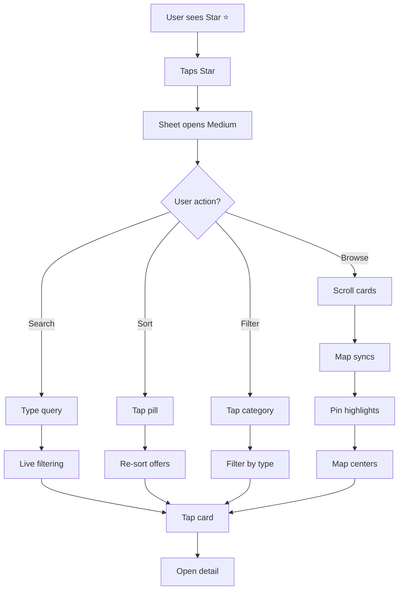

# 🚀 Explore Sheet - Quick Reference Card

## 📝 At a Glance

**3 Components** | **~700 LOC** | **0 Dependencies** | **100% TypeScript**

```
ExploreSheet ─── Premium discovery bottom sheet
OfferCard    ─── Compact offer display with badges
FloatingStarButton ─ Context-aware action button
```

## 🎯 5-Minute Integration

```tsx
// 1. Import
import { ExploreSheet } from '@/components/explore/ExploreSheet';
import { FloatingStarButton } from '@/components/explore/FloatingStarButton';

// 2. State
const [exploreOpen, setExploreOpen] = useState(false);

// 3. JSX
<ExploreSheet
  offers={offers}
  user={user}
  userLocation={userLocation}
  open={exploreOpen}
  onClose={() => setExploreOpen(false)}
  onOfferClick={(offer) => handleOfferClick(offer)}
/>

<FloatingStarButton
  exploreOpen={exploreOpen}
  onOpenExplore={() => setExploreOpen(true)}
/>
```

## ⚡ Key Features

| Feature | Description | Status |
|---------|-------------|--------|
| **Search** | Real-time filtering by title, description, partner | ✅ |
| **Sort** | 5 options: Recommended, Nearest, Cheapest, Expiring, Newest | ✅ |
| **Categories** | 12 types + "All" option with emoji icons | ✅ |
| **Clusters** | Trending, Closing Soon, Under 5 GEL, Fresh | ✅ |
| **Map Sync** | Highlights pins, centers on scroll | ✅ |
| **Drag States** | Collapsed → Medium → Expanded | ✅ |
| **Empty State** | Friendly message + "Clear Filters" button | ✅ |
| **Mobile-First** | Touch targets ≥ 44px, smooth gestures | ✅ |

## 🎨 Visual Identity

**Primary Color**: Cosmic Orange `#f97316 → #ea580c`  
**Animation**: Spring physics (damping: 30, stiffness: 300)  
**Typography**: System fonts, bold headers  
**Shadows**: Soft depth with orange glow  
**Borders**: `rounded-2xl` or `rounded-full`

## 📊 Component Props

### ExploreSheet
```tsx
{
  offers: Offer[];              // All offers to display
  user: User | null;            // Current user
  userLocation: [lat, lng];     // For distance calc
  open: boolean;                // Sheet visibility
  onClose: () => void;          // Close handler
  onOfferClick: (offer, idx) => void;  // Card click
  onCategorySelect?: (cat) => void;    // Category filter
  selectedCategory?: string;    // Active category
  onMapHighlight?: (id) => void;       // Pin highlight
  onMapCenter?: (loc) => void;  // Map pan/zoom
}
```

### OfferCard
```tsx
{
  offer: Offer;                 // Offer to display
  userLocation: [lat, lng];     // For distance
  onClick: () => void;          // Card click
  onInView?: () => void;        // Scroll into view
}
```

### FloatingStarButton
```tsx
{
  exploreOpen: boolean;         // Sheet state
  onOpenExplore: () => void;    // Open handler
  onSortChange?: (sort) => void; // Sort selection
  currentSort?: SortOption;     // Active sort
}
```

## 🔍 Sort Options

| ID | Label | Emoji | Logic |
|----|-------|-------|-------|
| `recommended` | Recommended | ⭐ | Server order |
| `nearest` | Nearest | 📍 | Distance ASC |
| `cheapest` | Cheapest | 💸 | Price ASC |
| `expiring` | Expiring Soon | ⏳ | End time ASC |
| `newest` | Newly Added | 🆕 | Created DESC |

## 📦 Offer Clusters

| Cluster | Emoji | Filter Logic | Max |
|---------|-------|--------------|-----|
| Trending | 🔥 | First 6 from sort | 6 |
| Closing Soon | ⏰ | Expires ≤ 2 hours | 6 |
| Under 5 GEL | 💸 | Price ≤ 5 | 6 |
| Freshly Baked | 🍞 | Bakery + today | 6 |

## 🎬 Drag States

```
COLLAPSED (12vh) ──drag up──> MEDIUM (50vh) ──drag up──> EXPANDED (85vh)
       ↓                            ↓                           ↓
   drag down                   drag down                   drag down
       ↓                            ↓                           ↓
     CLOSE                     COLLAPSED                    MEDIUM
```

## 🎯 User Flow



## 🐛 Common Issues

### Search not working?
- Check `searchQuery` state is bound to input
- Verify `offers` array has `title`, `description`, `partner.business_name`

### Map not centering?
- Ensure `googleMap` ref exists
- Check `onMapCenter` calls `googleMap.panTo(location)`

### Categories showing wrong icons?
- Verify `getCategoryIcon()` returns emoji string
- Check `MAIN_CATEGORIES` import is correct

### Distance showing NaN?
- Ensure `userLocation` is `[lat, lng]` tuple
- Verify `partner.location` exists on offer

## 📈 Performance Tips

```tsx
// 1. Memoize filtered offers
const filtered = useMemo(() => filterOffers(offers), [offers, filters]);

// 2. Debounce search
const debouncedQuery = useDebounce(searchQuery, 300);

// 3. Lazy load images


// 4. Virtual scrolling for 100+ offers
import { useVirtualizer } from '@tanstack/react-virtual';
```

## 🎨 Customization

### Change Brand Color
```bash
# Find and replace
from-orange-500 to-orange-600 → from-blue-500 to-blue-600
shadow-orange-500/30 → shadow-blue-500/30
text-orange-600 → text-blue-600
```

### Adjust Sheet Heights
```tsx
const HEIGHTS = {
  collapsed: '15vh',  // Was 12vh
  medium: '60vh',     // Was 50vh
  expanded: '90vh',   // Was 85vh
};
```

### Add Custom Cluster
```tsx
const myCluster = filteredOffers
  .filter(offer => /* your logic */)
  .slice(0, 6);

if (myCluster.length > 0) {
  clusters.push({
    id: 'my-cluster',
    title: 'My Custom Cluster',
    emoji: '🎉',
    offers: myCluster,
  });
}
```

## ✅ Testing Checklist

```bash
✓ Sheet opens on star tap
✓ Drags up/down smoothly
✓ Search filters instantly
✓ Sort pills change order
✓ Categories filter type
✓ Clusters appear correctly
✓ Map highlights on scroll
✓ Distance badges accurate
✓ Time badges turn red
✓ Star menu works when open
✓ Empty state shows properly
✓ Clear filters resets all
```

## 📚 Documentation

- **EXPLORE_SHEET_GUIDE.md** - Full implementation
- **EXPLORE_SHEET_DESIGN_REFERENCE.md** - Visual specs
- **EXPLORE_SHEET_COMPLETE_SUMMARY.md** - Overview
- **INTEGRATION_EXAMPLE.tsx** - Code samples

## 🎉 Ready to Go!

**Status**: 🟢 Production Ready  
**Type Safety**: 100%  
**Mobile Optimized**: Yes  
**Accessibility**: WCAG 2.1 AA  
**Browser Support**: Modern (ES2020+)

---

**Need Help?** Check the full guides in the docs folder!
