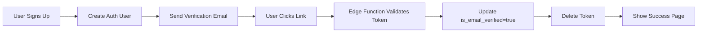
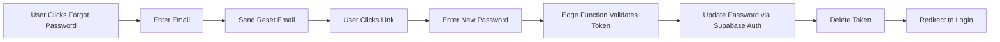

# 📧 Email Verification & Password Reset System - Complete Implementation Guide

## 🎯 Overview

Complete email notification system using **Resend.com** for SmartPick (Vite + React Router + Supabase).

**Supported Flows:**
1. ✅ Email verification after signup
2. 🔐 Password reset flow

---

## 📋 Prerequisites

1. **Resend Account**: Sign up at [resend.com](https://resend.com)
2. **Domain Verification**: Add and verify `smartpick.ge` in Resend dashboard
3. **Supabase Project**: Access to SQL Editor and Edge Functions
4. **Environment Variables**: Access to `.env.local` file

---

## 🗄️ Step 1: Database Setup

### 1.1 Apply the Migration

Run this SQL in **Supabase SQL Editor**:

```bash
supabase/migrations/20251121_email_verification_system.sql
```

This creates:
- ✅ `email_verification_tokens` table
- ✅ `password_reset_tokens` table
- ✅ `email_rate_limits` table (3 emails per 15 min)
- ✅ `is_email_verified` column in `users` table
- ✅ RLS policies for security
- ✅ `check_email_rate_limit()` function
- ✅ `cleanup_expired_tokens()` cleanup function

### 1.2 Verify Tables Created

```sql
-- Check tables exist
SELECT table_name 
FROM information_schema.tables 
WHERE table_schema = 'public' 
AND table_name IN ('email_verification_tokens', 'password_reset_tokens', 'email_rate_limits');

-- Check users table has new column
SELECT column_name, data_type 
FROM information_schema.columns 
WHERE table_name = 'users' AND column_name = 'is_email_verified';
```

### 1.3 Schedule Token Cleanup (Optional but Recommended)

If you have `pg_cron` extension enabled:

```sql
-- Schedule daily cleanup at 3 AM
SELECT cron.schedule(
    'cleanup-expired-tokens',
    '0 3 * * *',
    $$SELECT cleanup_expired_tokens()$$
);
```

Or manually run once a day:
```sql
SELECT cleanup_expired_tokens();
```

---

## 🚀 Step 2: Deploy Supabase Edge Functions

### 2.1 Install Supabase CLI (if not installed)

```powershell
npm install -g supabase
```

### 2.2 Login to Supabase

```powershell
supabase login
```

### 2.3 Link Your Project

```powershell
# Get your project reference from Supabase Dashboard URL
# Format: https://supabase.com/dashboard/project/YOUR_PROJECT_REF
supabase link --project-ref YOUR_PROJECT_REF
```

For SmartPick:
```powershell
supabase link --project-ref ggzhtpaxnhwcilomswtm
```

### 2.4 Deploy Edge Functions

```powershell
# Deploy verify-email function
supabase functions deploy verify-email

# Deploy password-reset function
supabase functions deploy password-reset
```

### 2.5 Verify Deployment

Check in **Supabase Dashboard → Edge Functions**:
- ✅ `verify-email` - Status: Active
- ✅ `password-reset` - Status: Active

Test URLs:
- Verify: `https://ggzhtpaxnhwcilomswtm.supabase.co/functions/v1/verify-email`
- Reset: `https://ggzhtpaxnhwcilomswtm.supabase.co/functions/v1/password-reset`

---

## 🔐 Step 3: Environment Variables

### 3.1 Update `.env.local`

Add these variables to your `.env.local` file:

```env
# Resend Email Service
VITE_RESEND_API_KEY=your_resend_api_key_here
RESEND_FROM_EMAIL=no-reply@smartpick.ge
VITE_PUBLIC_BASE_URL=https://www.smartpick.ge

# Supabase (existing)
VITE_SUPABASE_URL=https://ggzhtpaxnhwcilomswtm.supabase.co
VITE_SUPABASE_ANON_KEY=your_anon_key_here
```

### 3.2 Production Environment Variables

Set these in your hosting provider (Vercel/Netlify/etc.):

| Variable | Value | Note |
|----------|-------|------|
| `VITE_RESEND_API_KEY` | `your_resend_api_key_here` | Get from Resend dashboard |
| `RESEND_FROM_EMAIL` | `no-reply@smartpick.ge` | Must be verified |
| `VITE_PUBLIC_BASE_URL` | `https://www.smartpick.ge` | Production URL |

---

## 📦 Step 4: Install Dependencies

```powershell
# Install crypto-js for token generation
pnpm add crypto-js
pnpm add -D @types/crypto-js
```

---

## 🎨 Step 5: Frontend Integration

### 5.1 Update Signup Flow

In your signup component (e.g., `src/components/Auth.tsx` or wherever signup happens):

```tsx
import { sendVerificationEmail } from '../lib/api/email-verification';
import { useNavigate } from 'react-router-dom';

// After successful signup
const handleSignup = async (email: string, password: string, fullName: string) => {
  try {
    // 1. Create auth user
    const { data, error } = await supabase.auth.signUp({
      email,
      password,
      options: {
        data: { full_name: fullName }
      }
    });

    if (error) throw error;

    // 2. Send verification email
    if (data.user) {
      await sendVerificationEmail(data.user.id, email, fullName);
      
      // 3. Redirect to verification requested page
      navigate('/verify-requested');
      toast.success('Account created! Check your email to verify.');
    }
  } catch (error) {
    console.error('Signup error:', error);
    toast.error('Failed to create account');
  }
};
```

### 5.2 Add "Forgot Password" Link to Login Page

```tsx
<Link to="/forgot-password" className="text-sm text-blue-600 hover:underline">
  Forgot password?
</Link>
```

### 5.3 Show Verification Status in Profile

```tsx
import { useEffect, useState } from 'react';
import { supabase } from '../lib/supabase';

const [isEmailVerified, setIsEmailVerified] = useState(false);

useEffect(() => {
  const fetchVerificationStatus = async () => {
    const { data: { user } } = await supabase.auth.getUser();
    if (user) {
      const { data } = await supabase
        .from('users')
        .select('is_email_verified')
        .eq('id', user.id)
        .single();
      setIsEmailVerified(data?.is_email_verified || false);
    }
  };
  fetchVerificationStatus();
}, []);

// Display in UI
{!isEmailVerified && (
  <div className="bg-yellow-50 border border-yellow-200 p-4 rounded-lg">
    <p className="text-yellow-800">
      ⚠️ Your email is not verified. <button onClick={resendVerification}>Resend email</button>
    </p>
  </div>
)}
```

---

## 🧪 Step 6: Testing

### 6.1 Test Email Verification

1. **Signup**: Create a new account
2. **Check Email**: Look for email from `no-reply@smartpick.ge`
3. **Click Link**: Should redirect to `/verify-email?token=XXX`
4. **Verify Success**: Should see success message and redirect options
5. **Check Database**:
   ```sql
   SELECT is_email_verified FROM users WHERE email = 'test@example.com';
   -- Should return: true
   ```

### 6.2 Test Password Reset

1. **Go to**: `/forgot-password`
2. **Enter Email**: Your registered email
3. **Check Email**: Look for reset email
4. **Click Link**: Should redirect to `/reset-password?token=XXX`
5. **Set Password**: Enter new password
6. **Login**: Try logging in with new password

### 6.3 Test Rate Limiting

Try requesting 4 emails in a row:
- First 3: ✅ Should work
- 4th attempt: ❌ Should show: "Rate limit exceeded. Please try again in 15 minutes."

---

## 🛡️ Security Features Implemented

### ✅ Rate Limiting
- **Max 3 emails per 15 minutes** per email address per action type
- Prevents abuse and spam
- Database-enforced via `check_email_rate_limit()` function

### ✅ Token Security
- **30-minute expiration** on all tokens
- **One-time use**: Tokens marked as `used_at` after consumption
- **Secure random generation**: 64-character hex tokens via crypto-js
- **Database cleanup**: Auto-removes expired tokens

### ✅ Row Level Security (RLS)
- Users can only see their own tokens
- Service role has full access (for Edge Functions)
- No direct token access via public API

### ✅ Email Verification
- Prevents verification bombing (rate limited)
- Doesn't reveal if email exists in system (password reset)
- IP and User-Agent logging for audit trail

---

## 🔄 User Flows

### Flow 1: Email Verification



### Flow 2: Password Reset



---

## 📧 Email Templates

### Email 1: Verification Email
- **Subject**: `🎉 Verify Your Email - SmartPick`
- **From**: `no-reply@smartpick.ge`
- **Style**: Green gradient, welcome theme
- **CTA**: "Verify Email Address" button
- **Expiry Warning**: 30 minutes

### Email 2: Password Reset
- **Subject**: `🔐 Reset Your Password - SmartPick`
- **From**: `no-reply@smartpick.ge`
- **Style**: Orange gradient, security theme
- **CTA**: "Reset Password" button
- **Security Notice**: Warning if not requested

---

## 🐛 Troubleshooting

### Issue: Emails not sending

**Check:**
1. Resend API key is correct in `.env.local`
2. Domain `smartpick.ge` is verified in Resend dashboard
3. Check Resend dashboard → Logs for delivery errors
4. Check browser console for API errors

**Solution:**
```powershell
# Test Resend API directly
curl -X POST https://api.resend.com/emails \
  -H "Authorization: Bearer YOUR_RESEND_API_KEY" \
  -H "Content-Type: application/json" \
  -d '{"from":"no-reply@smartpick.ge","to":"your@email.com","subject":"Test","html":"<p>Test</p>"}'
```

---

### Issue: Edge Function returns 500 error

**Check:**
1. Edge Functions are deployed: `supabase functions list`
2. Environment variables are set in Supabase dashboard
3. Check Edge Function logs in Supabase dashboard

**Solution:**
```powershell
# View Edge Function logs
supabase functions logs verify-email
supabase functions logs password-reset
```

---

### Issue: Token not found / expired

**Check:**
1. Token in URL is complete (64 characters)
2. Token hasn't expired (30 min window)
3. Token hasn't been used already

**Solution:**
```sql
-- Check token status
SELECT * FROM email_verification_tokens WHERE token = 'YOUR_TOKEN_HERE';
SELECT * FROM password_reset_tokens WHERE token = 'YOUR_TOKEN_HERE';

-- Manually expire a token
UPDATE email_verification_tokens SET expires_at = NOW() - INTERVAL '1 hour' WHERE token = 'XXX';
```

---

### Issue: Rate limit error

**Check:**
```sql
-- View rate limit records
SELECT * FROM email_rate_limits WHERE email = 'user@example.com';

-- Reset rate limit for testing
DELETE FROM email_rate_limits WHERE email = 'user@example.com';
```

---

## 🚨 Production Checklist

Before going live:

- [ ] Database migration applied successfully
- [ ] Both Edge Functions deployed and active
- [ ] Domain verified in Resend dashboard
- [ ] Production environment variables set
- [ ] Test email verification flow end-to-end
- [ ] Test password reset flow end-to-end
- [ ] Test rate limiting (3 emails max)
- [ ] Verify email templates render correctly
- [ ] Check spam folder delivery (Resend has good deliverability)
- [ ] Setup monitoring for Edge Function errors
- [ ] Schedule daily `cleanup_expired_tokens()` job
- [ ] Update Privacy Policy to mention email usage

---

## 📊 Monitoring & Maintenance

### Check Email Delivery Stats

**Resend Dashboard**: [resend.com/emails](https://resend.com/emails)
- Delivery rate
- Bounce rate
- Click rate (for links)

### Database Maintenance

```sql
-- Check token table sizes
SELECT COUNT(*) FROM email_verification_tokens;
SELECT COUNT(*) FROM password_reset_tokens;
SELECT COUNT(*) FROM email_rate_limits;

-- Clean up expired tokens manually
SELECT cleanup_expired_tokens();

-- View rate limit usage
SELECT email, action_type, attempts, last_attempt 
FROM email_rate_limits 
WHERE window_start > NOW() - INTERVAL '15 minutes';
```

### Edge Function Metrics

**Supabase Dashboard → Edge Functions**:
- Invocation count
- Error rate
- Average response time

---

## 🎓 Usage Examples

### Resend Verification Email

```tsx
import { sendVerificationEmail } from '../lib/api/email-verification';

await sendVerificationEmail(userId, 'user@example.com', 'John Doe');
```

### Request Password Reset

```tsx
import { sendPasswordResetEmail } from '../lib/api/email-verification';

try {
  await sendPasswordResetEmail('user@example.com');
  toast.success('Reset email sent!');
} catch (error) {
  if (error.message.includes('Rate limit')) {
    toast.error('Too many attempts. Try again in 15 minutes.');
  }
}
```

### Verify Email with Token

```tsx
import { verifyEmailWithToken } from '../lib/api/email-verification';

const result = await verifyEmailWithToken(token);
if (result.success) {
  console.log('Email verified!');
}
```

### Reset Password with Token

```tsx
import { resetPasswordWithToken } from '../lib/api/email-verification';

await resetPasswordWithToken(token, 'newPassword123');
```

---

## 📚 Additional Resources

- **Resend Docs**: [resend.com/docs](https://resend.com/docs)
- **Supabase Edge Functions**: [supabase.com/docs/guides/functions](https://supabase.com/docs/guides/functions)
- **React Email Templates**: [react.email](https://react.email)

---

## 🎉 System Complete!

All components are implemented and ready to deploy:

✅ **Database**: Tables, RLS policies, rate limiting  
✅ **Edge Functions**: Token validation endpoints  
✅ **Frontend**: 4 new pages (verify-email, reset-password, forgot-password, verify-requested)  
✅ **Email Templates**: Beautiful HTML emails via Resend  
✅ **Security**: Rate limiting, token expiry, one-time use  
✅ **Integration**: Ready to plug into signup flow  

**Next Step**: Follow the deployment guide above! 🚀
